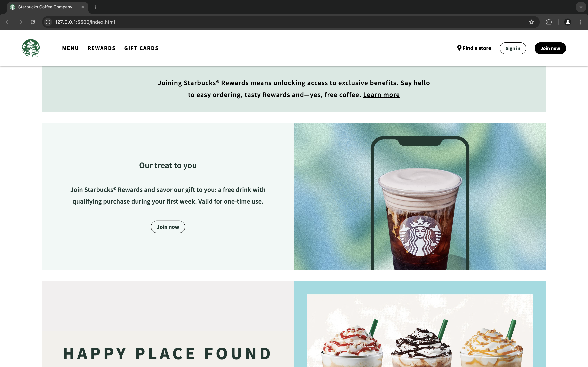

# Starbucks Coffee Company Website

Welcome to the Starbucks Coffee Company website repository. This project includes the HTML and CSS files that create a responsive, visually appealing landing page for Starbucks.

## Table of Contents

- [Project Overview](#project-overview)
- [File Structure](#file-structure)
- [HTML Breakdown](#html-breakdown)
- [CSS Breakdown](#css-breakdown)
- [Setup and Usage](#setup-and-usage)
- [Contributing](#contributing)
- [License](#license)

## Project Overview

This project creates a static webpage for Starbucks Coffee Company. It includes features like a navigation bar, mobile menu, promotional sections, and footer. The site is designed to be responsive and visually consistent across different devices.

## File Structure

The project consists of the following files:

- `index.html`: The main HTML file that structures the webpage.
- `styles.css`: The CSS file for styling the webpage.

### index.html

This file contains the main structure of the Starbucks website, including the header, navigation bar, promotional sections, and footer.

### styles.css

This file contains the styles for the webpage, including layout, typography, and responsive design rules.

## HTML Breakdown

### Header

- **Logo**: Displays the Starbucks logo.
- **Navigation Bar**: Includes two navigation sections:
  - `nav-1`: Links to Menu, Rewards, and Gift Cards.
  - `nav-2`: Links to Find a Store, Sign in, and Join Now.

### Mobile Menu

- **Toggle Menu**: A checkbox and label mechanism to handle mobile menu visibility.
- **Sidebar Menu**: Contains nested menu items and additional navigation links.

### Promotional Sections

- **Notice**: Displays a promotional message about Starbucks Rewards.
- **Food Menu Items**: Showcases various promotional items with images, titles, descriptions, and call-to-action buttons.

### Footer

- **Social Media Icons**: Links to Starbucks' social media profiles.
- **Footer Links**: Sections for About Us, Careers, Social Impact, Business Partners, and Order & Pickup.

## CSS Breakdown

### General Styles

- **Reset and Box Model**: Resets margin and padding, sets box-sizing to border-box.
- **Font and Text Styles**: Uses Source Sans Pro font and sets default text decoration and list styles.

### Header

- **Layout**: Flexbox is used for positioning the logo and navigation items.
- **Styles**: Includes hover effects for navigation links and buttons.

### Promotional Sections

- **Notice**: Styles the background color, text alignment, and link behavior.
- **Food Menu Items**: Defines the layout and styles for the food menu sections, including image and text alignment.

### Footer

- **Layout**: Uses flexbox for social media icons and styles for footer links.
- **Styles**: Includes hover effects for icons and links, and a shadow effect for the icons.

## Setup and Usage

To view this webpage locally:

1. **Clone the Repository:**

   ```bash
   git clone https://github.com/alisherbegmatov/starbucks.git
   ```

2. **Navigate to the Project Directory:**

   ```bash
   cd starbucks
   ```

3. **Open `index.html` in a Web Browser:**
   You can open `index.html` directly in your browser to view the website.

## Contributing

Contributions are welcome! Please fork the repository and submit a pull request with your proposed changes.

## License

This project is licensed under the MIT License. See the [LICENSE](LICENSE) file for details.
